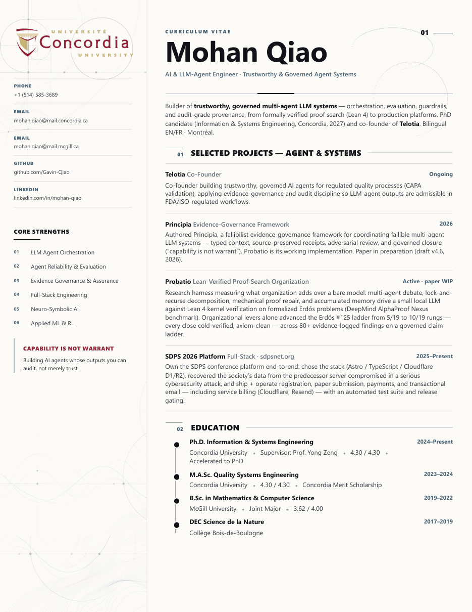
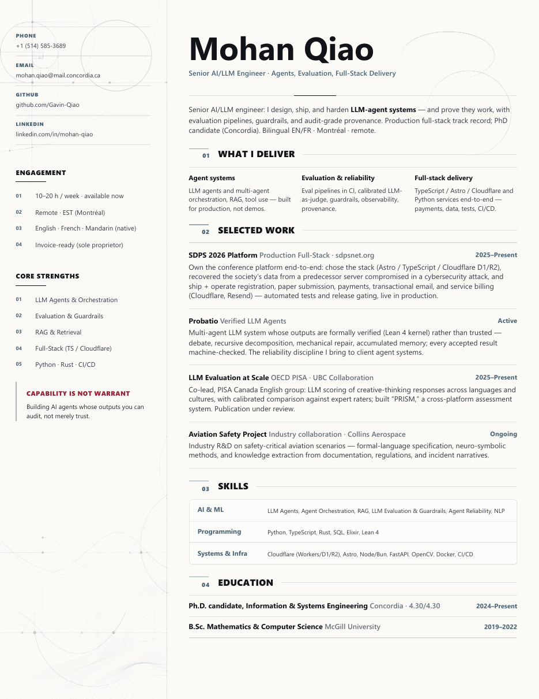
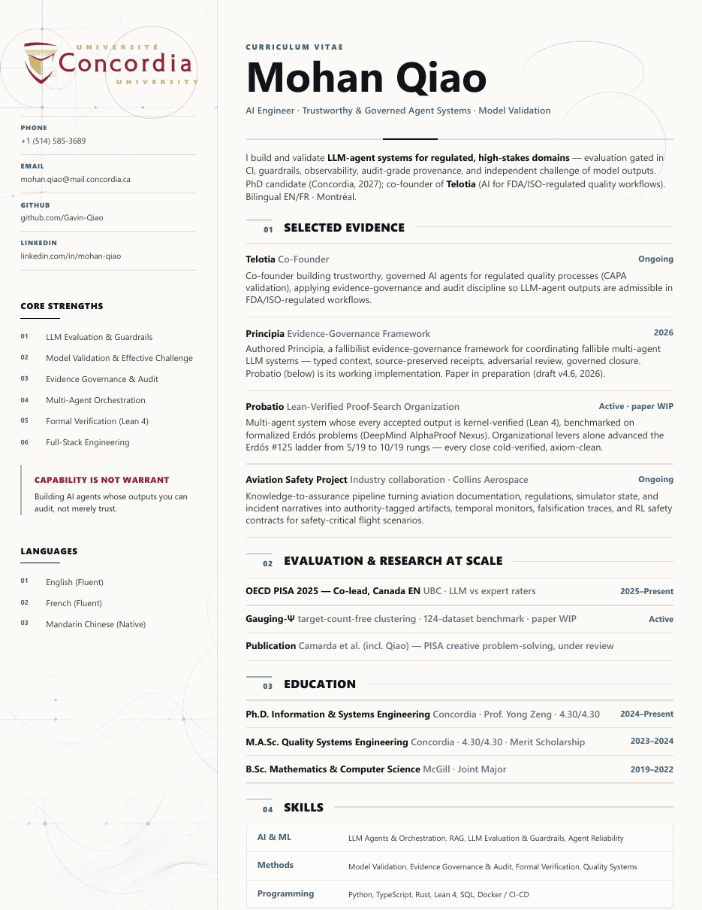

<div align="center">

# mohan-cv

**Print-perfect CV as code. One stylesheet, plain content files, any language.**

A multi-page curriculum vitae built in HTML and CSS with a small dependency-free renderer — no framework, no build step, no server required. Content lives in per-language data files that anyone can find and edit; the page assembles itself, offers a language toggle on screen, and prints pixel-identical, toggle-free PDFs.

[](#)
[](#)
[](#license)
[](https://www.conventionalcommits.org)

<br>

| Master (3 pages) | Contract one-pager | Research one-pager |
|:---:|:---:|:---:|
|  |  |  |

</div>

---

## Why CV as code

A CV maintained as a document drifts: formats fork, exports go stale, and every tailored version becomes a divergent copy. Treating the CV as a small codebase fixes all three — content is versioned and diffable, variants share one stylesheet instead of forking it, and the PDF is a reproducible build artifact rather than a hand-exported snapshot.

## Features

- **Content as data, one file per language.** Your CV lives in `content/master.en.js`, `content/master.fr.js`, and so on — plain, commented JavaScript objects that tolerate trailing commas and multiline strings, and load from `file://` with no server and no CORS ceremony (the reason they are not JSON).
- **Automatic language toggle.** The renderer discovers every registered language and builds a floating EN / FR / … switch by itself. It is screen-only chrome: `@media print` removes it, so PDFs never show it.
- **True page model.** Each page is a fixed US-Letter (8.5 × 11 in) canvas with a sidebar and content column. What you see in the browser is exactly what prints.
- **Design tokens.** Colors, accents, shadows, and page geometry live in CSS custom properties at the top of `styles.css`. Rebrand the entire document by editing one block.
- **Print discipline built in.** `@media print` rules emit clean Letter pages with exact colors; links survive as clickable PDF annotations.
- **No build, no dependencies.** One vanilla-JS renderer (`renderer.js`), readable top to bottom. Open `index.html` directly, or serve the folder with the included single-file Bun server.

## Quick start

```sh
git clone https://github.com/Gavin-Qiao/mohan-cv.git
cd mohan-cv

# Preview — any static server works; a Bun one is included
bun server.js          # http://localhost:4173
```

Then open `content/master.en.js` and make it yours — every word of the document lives there.

## Export to PDF

Any Chromium browser produces a faithful PDF; the `?lang=` parameter selects the edition. Headless, from the command line:

```sh
# Windows (Edge)
& "C:\Program Files (x86)\Microsoft\Edge\Application\msedge.exe" `
  --headless --disable-gpu --no-pdf-header-footer `
  --print-to-pdf="cv-master-en.pdf" "file:///C:/path/to/mohan-cv/index.html?lang=en"

# macOS / Linux (Chrome)
google-chrome --headless --disable-gpu --no-pdf-header-footer \
  --print-to-pdf="cv-master-fr.pdf" "file:///path/to/mohan-cv/index.html?lang=fr"
```

Repeat for `cv-contract.html` and `cv-postgrad.html`. Or simply print from the browser with margins set to None — the language toggle never appears in print.

## Structure

| Path | Purpose |
|---|---|
| `content/master.en.js` | English content — edit your CV here |
| `content/master.fr.js` | French content — same shape, French words |
| `index.html` | Thin shell: stylesheet, content scripts, renderer |
| `renderer.js` | Dependency-free renderer: pages, sections, language toggle |
| `styles.css` | Design tokens, page model, all components |
| `cv-contract.html` | Static one-page variant for contract and fractional work |
| `cv-postgrad.html` | Static one-page variant for research and industry roles |
| `assets/` | Sidebar motif and affiliation marks |
| `server.js` | Optional zero-dependency Bun preview server |
| `docs/` | Rendered previews used by this README |

## Make it yours

**1. Replace the content.** Everything — name, summary, cards, section order, pagination — lives in `content/master.en.js` as one commented object. Sections are typed (`projects`, `timeline`, `experience`, `honors`, `publications`, `focus`, `skills`); add, remove, and reorder items freely. Values accept inline HTML for links and emphasis.

**2. Retheme with tokens.** Everything visual hangs off the custom properties in `:root`:

| Token | Role |
|---|---|
| `--brand` | Accent for emphasis marks and the sidebar quote |
| `--accent` / `--accent-soft` | Section indexes, labels, timeline accents |
| `--paper` / `--ink` / `--ink-soft` / `--muted` | Surface and three text strengths |
| `--page-width` / `--page-height` | Page geometry (swap in `210mm`/`297mm` for A4) |

**3. Replace personal assets.** The affiliation mark and sidebar motif under `assets/` are personal to this instance. Substitute your own — institutional logos are trademarks of their owners and are not covered by this repository's license.

**4. Respect the page budget.** Pages are fixed-height with `overflow: hidden`, which keeps print honest but clips silently. After any content change, export the PDF and check the bottom of each page; if a section disappeared, trim a card or move a block to the sidebar. Treat it like a failing test.

**5. Derive a variant.** Copy one `<article class="page">` into a new file, keep the stylesheet link, retitle the hero, and curate cards for one audience. A variant should answer one reader, on one page.

## Add a language

Languages are just content files; the renderer and toggle adapt to whatever is registered.

1. Copy `content/master.en.js` to `content/master.de.js` (or any [ISO 639-1 code](https://en.wikipedia.org/wiki/List_of_ISO_639_language_codes)).
2. Change the registration key and metadata at the top — `window.CV_CONTENT["de"]`, `label: "DE"`, `htmlLang: "de"` — and translate the values.
3. Add one line to `index.html`:

```html
<script src="./content/master.de.js"></script>
```

The toggle now offers DE automatically. Visitors get their browser's language by default when it is available, their explicit choice is remembered, and `?lang=de` forces an edition — which is also how you export each PDF. Translations usually run longer than the original, so re-check every page against the fixed-page budget after translating.

## Commit convention

This repository follows [Conventional Commits](https://www.conventionalcommits.org):

| Prefix | Used for |
|---|---|
| `feat:` | New documents, sections, or capabilities |
| `fix:` | Layout, overflow, or content corrections |
| `docs:` | README and documentation |
| `style:` | Visual changes with no content change |
| `chore:` | Tooling, ignores, maintenance |

## License

Code and stylesheet are released under the [MIT License](LICENSE).

The personal content of this instance — name, biography, project descriptions, photographs, and all logos and marks under `assets/` — is **not** licensed for reuse. Replace it with your own before publishing a fork.
