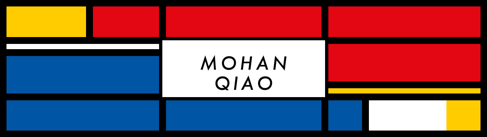

<!--
  GitHub profile README for Gavin-Qiao (Mohan Qiao).
  French edition: README.fr.md

  Motion kit — Neo-Plasticism / De Stijl:
  - neo-01-grid.gif — slow mechanical grid + name in white plane
  - readme-typing-svg (dual-mode), summary cards, ghchart (Mondrian red)
  Motto (Clifford) once under the header only.
-->

<div align="center">
  
</div>

<!-- Typing roles: dual-mode via prefers-color-scheme (light ink / dark paper) -->
<p align="center">
  <picture>
    <source
      media="(prefers-color-scheme: dark)"
      srcset="https://readme-typing-svg.demolab.com?font=IBM+Plex+Sans&weight=600&size=22&duration=3200&pause=900&color=E6EDF3&center=true&vCenter=true&multiline=false&width=640&height=36&lines=AI+%26+LLM-agent+engineer;PhD+%40+Concordia+University;Founder+%40+Telotia;IT+Director+%40+SDPS"
    />
    <source
      media="(prefers-color-scheme: light)"
      srcset="https://readme-typing-svg.demolab.com?font=IBM+Plex+Sans&weight=600&size=22&duration=3200&pause=900&color=1F2328&center=true&vCenter=true&multiline=false&width=640&height=36&lines=AI+%26+LLM-agent+engineer;PhD+%40+Concordia+University;Founder+%40+Telotia;IT+Director+%40+SDPS"
    />
    
  </picture>
</p>

<div align="center">

**EN** · [**FR**](./README.fr.md)

**Trustworthy & governed multi-agent systems**

PhD candidate · Information & Systems Engineering · Concordia University  
Founder, [Telotia](https://telotia.com) · Montréal · bilingual EN / FR

[](https://telotia.com)
[](https://sdpsnet.org)
[](https://linkedin.com/in/mohan-qiao)
[](mailto:mohan.qiao@mail.concordia.ca)
[](https://github.com/Gavin-Qiao)

<br/>

> *It is wrong always, everywhere, and for anyone, to believe anything upon insufficient evidence.*  
> — W. K. Clifford, *The Ethics of Belief* (1877)

I build systems that treat claims as claims until the evidence says otherwise.

</div>

---

## Featured build — [sdpsnet.org](https://sdpsnet.org)

Primary builder of the Society for Design and Process Science web platform — product, stack, data recovery, shipping, and day-to-day operations.

| | |
| --- | --- |
| **Society site** | [sdpsnet.org](https://sdpsnet.org) — membership, journal, history, leadership |
| **Conference** | [2026.sdpsnet.org](https://2026.sdpsnet.org) — SDPS 2026 · Leuven · 23–26 Aug 2026 |
| **Stack** | Astro · TypeScript · Cloudflare (Workers / D1 / R2) · payments · transactional email |
| **Scope** | Registration, paper submission, billing, release gating, automated tests |

Recovered the society’s data after a serious compromise of the predecessor server, then rebuilt and now operate the live stack — including service billing (Cloudflare, Resend).

---

## What I work on

I design **governed multi-agent LLM systems**: orchestration, evaluation, guardrails, and audit-grade provenance — from formally verified proof search (Lean 4) to production platforms for regulated workflows.

| Focus | What that means in practice |
| --- | --- |
| **Trustworthy agents** | Multi-agent orchestration with explicit roles, failure modes, and closure criteria |
| **Evidence & assurance** | Source-preserved receipts, monitors, and claim ladders that survive scrutiny |
| **Human & model evaluation** | Cross-cultural creativity assessment, calibrated scoring, interpretable eval |

Currently: PhD at Concordia, building Telotia (public launch September), and shipping SDPS as above.

---

## Selected work

### Telotia — founder · coming September
Software for **claim-to-evidence validation**: take a report and a body of evidence you trust, break the report into atomic claims, and for each one return supporting or contradicting evidence — or flag that none exists — with a citation-backed receipt and a graded verdict. It is not a chatbot and does not replace expert sign-off; it makes sure nothing important slipped through before a skeptical reviewer sees the document.

First product: a CAPA / quality-investigation workbench for medical-device quality teams. Public surface opening **September**.  
→ [telotia.com](https://telotia.com)

### Research highlights
- **Aviation safety** (Collins Aerospace collab) — knowledge-to-assurance pipeline: authority-tagged artifacts, temporal monitors, falsification traces, RL safety contracts  
- **Gauging-Ψ** — target-count-free exploratory clustering (recursive MST + adaptive tolerance graphs); 124 labeled datasets  
- **OECD PISA 2025 creative thinking** — co-lead, PISA Canada English group (UBC collab); PRISM assessment system + LLM scoring of divergent thinking  

---

## Stack I reach for

```text
AI / agents     Python · Lean 4 · RAG · eval & guardrails · neuro-symbolic · RL
Languages       TypeScript · Rust · Elixir · SQL · C/C++
Platforms       Cloudflare (Workers / D1 / R2) · Astro · Bun · FastAPI · Docker
Methods         Evidence governance · formal verification · experiment design
```

<p align="center">
  
  
  
  
  
  
  
  
</p>

---

## Elsewhere on this profile

| Repo | What it is |
| --- | --- |
| [**vserve**](https://github.com/Gavin-Qiao/vserve) | CLI for managing vLLM inference on GPU workstations — download, tune, serve, fan control |
| [**organon**](https://github.com/Gavin-Qiao/organon) | Research / systems tooling |
| [**concordia-style**](https://github.com/Gavin-Qiao/concordia-style) | Concordia University design system foundations (React + Tailwind v4) |

This repository also hosts **CV as code** — typed content files, one print-grade stylesheet, EN/FR editions, reproducible PDF export. Open `index.html` (or `bun run dev`) to view; edit `content/master.en.ts`.

---

## Snapshot

<!-- github-readme-stats.vercel.app is currently DEPLOYMENT_PAUSED; using profile-summary-cards.
     Dual-mode: light vs dark themes via <picture> + prefers-color-scheme. -->
<div align="center">

<picture>
  <source media="(prefers-color-scheme: dark)" srcset="https://github-profile-summary-cards.vercel.app/api/cards/stats?username=Gavin-Qiao&theme=github_dark" />
  
</picture>
<picture>
  <source media="(prefers-color-scheme: dark)" srcset="https://github-profile-summary-cards.vercel.app/api/cards/repos-per-language?username=Gavin-Qiao&theme=github_dark" />
  
</picture>

<br/>

<picture>
  <source media="(prefers-color-scheme: dark)" srcset="https://streak-stats.demolab.com/?user=Gavin-Qiao&theme=dark&hide_border=true&border_radius=0&ring=E30613&fire=E30613&currStreakNum=E30613" />
  
</picture>

<br/><br/>

<!-- Contribution calendar — Mondrian red (readable on both themes) -->


</div>

---

## Background

| | |
| --- | --- |
| **Ph.D.** Information & Systems Engineering | Concordia University · 2024– · 4.30/4.30 · accelerated |
| **M.A.Sc.** Quality Systems Engineering | Concordia University · 2023–2024 · Merit Scholarship |
| **B.Sc.** Mathematics & Computer Science | McGill University · joint major · 2019–2022 |
| **Service** | IT Director, Society of Design and Process Science (SDPS) — [sdpsnet.org](https://sdpsnet.org) |

Also: teaching assistant (INSE 6411 — Product Design Theory & Methodology), research assistantships in UAV remote sensing and cyber-physical IoT security, and co-authorship on cross-cultural cognitive flexibility work from PISA creative problem-solving (under review).

---

<div align="center">

**Open to collaboration** on agent reliability, evidence-governed AI systems, and research that has to hold up outside the demo.

[Website](https://telotia.com) · [SDPS](https://sdpsnet.org) · [LinkedIn](https://linkedin.com/in/mohan-qiao) · [Email](mailto:mohan.qiao@mail.concordia.ca) · [GitHub](https://github.com/Gavin-Qiao) · [Français](./README.fr.md)

</div>
